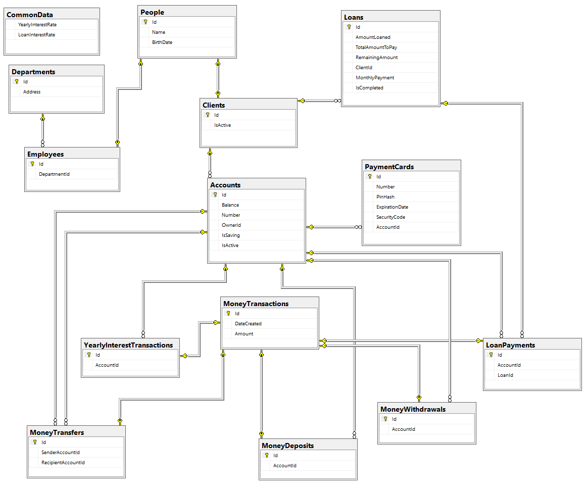

# Database model of a Bank 
See the general requirements [here](https://www.ms.mff.cuni.cz/~kopecky/vyuka/dbapl/).

## Data model

## Create schema
- run [create_tables.sql](create_tables.sql)
- run [create_views.sql](create_views.sql)
- run [create_procedures.sql](create_procedures.sql)
- run [create_functions.sql](create_functions.sql)

## Insert test data
- run [insert_test_data.sql](insert_test_data.sql)

## Test scripts
- there are two tests scripts in `test_scripts` folder. Run these immediately 
after `insert_test_data` (these scripts contain hard-coded IDs). Otherwise, it may not work.
Firstly run [test01](test_scripts/test01.sql) and then [test02](test_scripts/test02.sql). 

## Drop all tables, views and procedures
- run [drop_all.sql](drop_all.sql)
